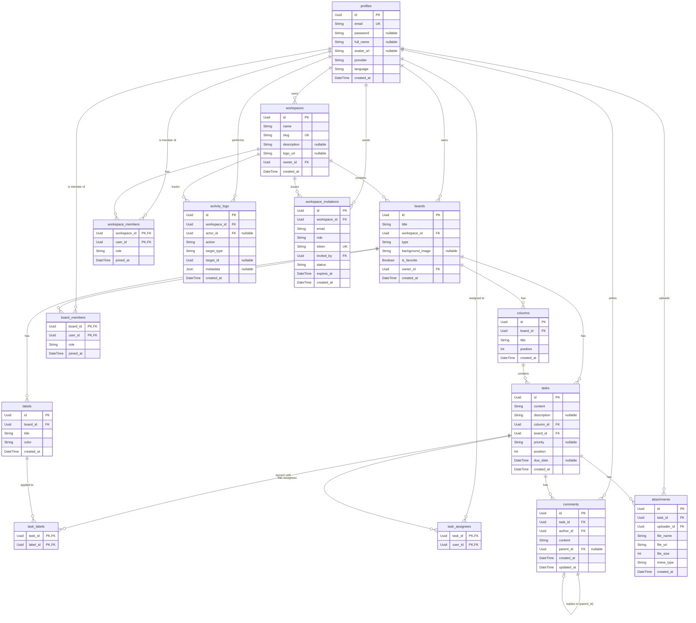

<p align="center">
  <h1 align="center">Taskbox</h1>
  <p align="center">
    A real-time, collaborative project management platform inspired by Trello — built from scratch with a modern TypeScript stack.
  </p>
</p>

<p align="center">
  <a href="#architecture">Architecture</a> •
  <a href="#features">Features</a> •
  <a href="#tech-stack">Tech Stack</a> •
  <a href="#getting-started">Getting Started</a> •
  <a href="#deployment">Deployment</a>
</p>

---

## Why This Project?

Taskbox is a **production-grade Kanban board** built to demonstrate full-stack engineering proficiency — not as a tutorial exercise, but as a system designed with the same concerns you'd face on a real team: **real-time sync**, **role-based access**, **file storage**, **i18n**, and **containerized & cloud-based deployment**.

Every architectural decision was intentional. This README walks through those decisions.

---

## Architecture

```
taskbox/
├── fe/                    # React SPA (Vite + TypeScript)
│   ├── src/
│   │   ├── features/      # Domain-driven feature modules
│   │   │   ├── auth/
│   │   │   ├── boards/    # Kanban board engine (DnD, columns, tasks)
│   │   │   ├── landing/
│   │   │   ├── planner/   # Cross-board timeline/calendar view
│   │   │   ├── profile/
│   │   │   ├── settings/
│   │   │   └── workspaces/
│   │   ├── components/    # Shared UI primitives (Radix-based)
│   │   ├── store/         # Redux Toolkit (global state)
│   │   ├── i18n/          # Internationalization (EN/VI)
│   │   └── router/
│   └── vercel.json        # SPA rewrite rules
│
├── be/                    # Express.js REST API
│   ├── src/
│   │   ├── modules/       # Domain modules (auth, boards, tasks, etc.)
│   │   ├── config/        # Env validation (Zod), Passport, Socket.IO
│   │   ├── middleware/     # Auth guards, error handler
│   │   └── lib/           # Shared utilities
│   ├── prisma/
│   │   └── schema.prisma  # 13-model relational schema
│   └── Dockerfile         # Multi-stage production build
│
└── podman-compose.yml     # Local dev orchestration (API + PostgreSQL)
```

### Key Architectural Decisions

| Decision | Rationale |
|---|---|
| **Feature-sliced frontend** | Each domain (boards, workspaces, planner) is self-contained with its own components, pages, types, and state slice. Scales without cross-feature coupling. |
| **Modular backend** | Each module (auth, boards, tasks, comments) owns its controller, service, and validation. No monolithic route file. |
| **Zod for env validation** | Server crashes immediately on startup with a clear error if any required env var is missing — not silently at runtime. |
| **Socket.IO for real-time** | Board updates, column reordering, and task mutations broadcast live to all connected clients. This is why the backend runs on a persistent server (not serverless). |
| **Prisma ORM** | Type-safe database access with auto-generated client. Schema serves as the single source of truth for the data model. |
| **Containerized dev env** | `podman-compose.yml` spins up both PostgreSQL and the API server in one command. No "works on my machine" issues. |

---

## Features

### Board Engine
- **Drag & drop** columns and tasks with optimistic UI updates (`@hello-pangea/dnd`)
- **Task detail modal** with rich-text description editor (TipTap), labels, priority, due dates, multi-assignees
- **Column operations** — copy list (with all cards), move list to another board, move all cards between lists
- **Board sharing** — add workspace members to specific boards with role-based visibility (public/private)

### Collaboration
- **Real-time sync** — changes propagate instantly via WebSockets to all board viewers
- **Threaded comments** — nested reply system on task cards with edit/delete capabilities
- **File attachments** — upload files to tasks via AWS S3 with pre-signed URLs
- **Activity logging** — workspace-level audit trail for member/board actions

### Workspace Management
- **Multi-workspace support** — create and switch between isolated team workspaces
- **Team invitations** — invite members via email with token-based acceptance flow (Nodemailer + SMTP)
- **Role-based access** — owner / admin / member hierarchy at workspace and board levels
- **Board starring** — quick-access favorites across workspaces

### User Experience
- **Internationalization** — full EN/VI translation coverage (330+ keys) with language preference persistence
- **Google OAuth** — one-click authentication via Passport.js with JWT session management
- **Timeline Planner** — cross-board calendar view showing all deadlines in week/month views
- **Dark/Light/System themes** — persisted user preference
- **Responsive design** — mobile-first layouts across all pages

---

## Tech Stack

### Frontend
| Technology | Purpose |
|---|---|
| **React 19** + **TypeScript** | UI framework with strict type safety |
| **Vite 7** | Build tooling with HMR |
| **Redux Toolkit** | Predictable state management with async thunks |
| **Tailwind CSS v4** | Utility-first styling |
| **Radix UI** | Accessible, unstyled component primitives |
| **TipTap** | Rich-text editor for task descriptions |
| **@hello-pangea/dnd** | Drag-and-drop board interactions |
| **Motion** (Framer) | Micro-animations and transitions |
| **react-i18next** | Internationalization framework |
| **Zod v4** | Client-side form validation |
| **Socket.IO Client** | Real-time event subscriptions |

### Backend
| Technology | Purpose |
|---|---|
| **Express.js** | HTTP server with modular routing |
| **TypeScript** | End-to-end type safety |
| **Prisma** | Type-safe ORM with migration management |
| **PostgreSQL** | Relational database |
| **Socket.IO** | Bidirectional real-time communication |
| **Passport.js** | Google OAuth 2.0 + JWT strategy |
| **Zod** | Runtime environment and request validation |
| **AWS S3** | File storage with pre-signed upload/download URLs |
| **Nodemailer** | Transactional emails for workspace invitations |
| **Helmet** | HTTP security headers |

### Infrastructure
| Technology | Purpose |
|---|---|
| **Podman/Docker Compose** | Local development orchestration |
| **Multi-stage Dockerfile** | Optimized production image (Alpine-based) |
| **Vercel** | Frontend hosting with SPA routing |
| **Vercel Postgres** | Managed production database |
| **Render** | Persistent Node.js backend hosting |
| **UptimeRobot** | Keep-alive monitoring to prevent server spin-down |

---

## Database Schema

13 interconnected models handling the full domain:



Key design choices:
- **Cascade deletes** — deleting a workspace removes all boards, columns, tasks, and related data
- **Self-referencing comments** — `parent_id` enables threaded replies without a separate table
- **Composite primary keys** — join tables (`task_labels`, `board_members`, `workspace_members`) use composite PKs instead of synthetic IDs
- **Nullable foreign keys** — `ActivityLog.actor_id` is nullable so logs survive user deletion

---

## Getting Started

### Prerequisites
- **Node.js** ≥ 20
- **Podman** or **Docker** (with Compose)

### 1. Clone and configure

```bash
git clone https://github.com/your-username/taskbox.git
cd taskbox
cp .env.example .env
# Fill in your environment variables (see .env.example for reference)
```

### 2. Start the development environment

```bash
# Spin up PostgreSQL + API server
podman-compose up -d --build

# Or use the rebuild script for a clean start
./rebuild.sh
```

### 3. Start the frontend

```bash
cd fe
npm install
npm run dev
# → http://localhost:5173
```

### Environment Variables

<details>
<summary><strong>Backend (.env)</strong></summary>

| Variable | Description |
|---|---|
| `DATABASE_URL` | PostgreSQL connection string |
| `JWT_SECRET` | Secret for signing JWT tokens |
| `CLIENT_URL` | Frontend URL for CORS |
| `PORT` | Server port (default: 3001) |
| `GOOGLE_CLIENT_ID` | Google OAuth client ID |
| `GOOGLE_CLIENT_SECRET` | Google OAuth client secret |
| `GOOGLE_CALLBACK_URL` | OAuth redirect URI |
| `AWS_S3_BUCKET` | S3 bucket for file attachments |
| `AWS_S3_REGION` | AWS region |
| `AWS_ACCESS_KEY_ID` | AWS credentials |
| `AWS_SECRET_ACCESS_KEY` | AWS credentials |
| `SMTP_HOST` | SMTP server for invitation emails |
| `SMTP_PORT` | SMTP port |
| `SMTP_USER` | SMTP username |
| `SMTP_PASS` | SMTP password |
| `SMTP_FROM` | Sender email address |

</details>

<details>
<summary><strong>Frontend (fe/.env)</strong></summary>

| Variable | Description |
|---|---|
| `VITE_API_URL` | Backend API base URL |

</details>

---

## Deployment

The application is deployed across a modern, decoupled cloud architecture:

| Layer | Service | Why |
|---|---|---|
| **Frontend** | Vercel | Optimized for React SPA hosting with edge caching |
| **Backend** | Render | Persistent web service required for live WebSocket connections |
| **Database** | Vercel Postgres | Managed serverless PostgreSQL with built-in connection pooling |
| **Auth** | Google OAuth 2.0 | Secure, passwordless authentication integrated via Passport.js |

**Note on Backend Persistence:** Render's free tier spins down instances after 15 minutes of inactivity. To keep the WebSocket connections alive 24/7 without cold starts, an **UptimeRobot** monitor is configured to ping the backend's `/health` endpoint every 5 minutes.

---

## License

This project is for educational and portfolio purposes.
